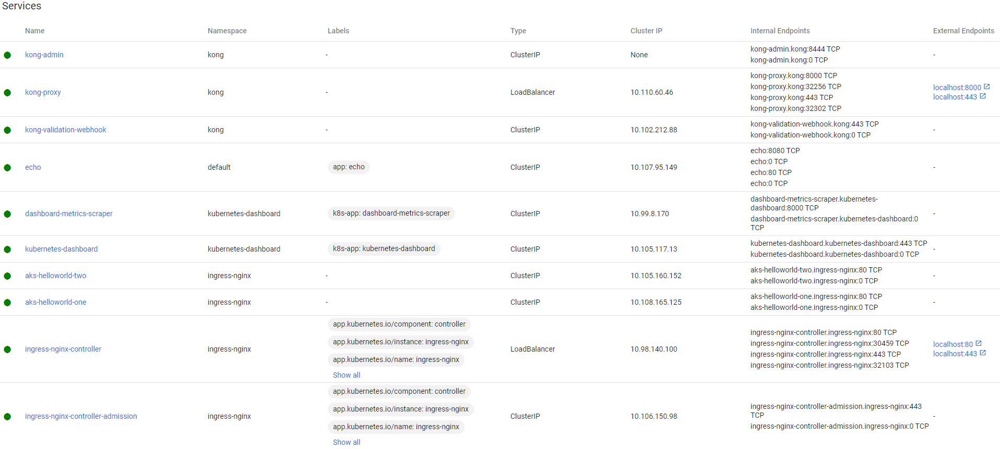

## Set up Ingress on Docker Desktop with the NGINX Ingress Controller

&nbsp;
&nbsp;

&nbsp;

The separation between Ingress rules (objects) and the ingress controller makes it easy to compare different reverse proxy implementations and see which gives you the combination of features and usability you're happy with.
&nbsp;

Kubernetes does let you run multiple ingress controllers, and in a complex environment, you may do that to provide different sets of capabilities for different applications.

&nbsp;

### 1. Enable K8s on Docker Desktop backed by WSL2

&nbsp;
&nbsp;

&nbsp;
&nbsp;

### 2. Install the NGINX Ingress controller

&nbsp;
&nbsp;

check out the latest version here: https://github.com/kubernetes/ingress-nginx

&nbsp;
&nbsp;

kubectl apply -f https://raw.githubusercontent.com/kubernetes/ingress-nginx/controller-v1.3.0/deploy/static/provider/cloud/deploy.yaml

&nbsp;
&nbsp;

### 3. Check the Ingress controller pod is running

&nbsp;
&nbsp;

kubectl get pods --namespace ingress-nginx

&nbsp;
&nbsp;

### 4. Check the NGINX Ingress controller has been assigned a public Ip address

&nbsp;
&nbsp;

kubectl get service ingress-nginx-controller --namespace=ingress-nginx

&nbsp;
&nbsp;

### 5. Set up two web apps

&nbsp;
&nbsp;

kubectl apply -f aks-helloworld-one.yaml --namespace ingress-nginx

&nbsp;

kubectl apply -f aks-helloworld-two.yaml --namespace ingress-nginx

&nbsp;
&nbsp;

### 6. Setup the Ingress to route traffic between the two apps

&nbsp;
&nbsp;

kubectl apply -f hello-world-ingress.yaml --namespace ingress-nginx

&nbsp;
&nbsp;

### 7. Browse to the EXTERNAL-IP/, EXTERNAL-IP/hello-world-one, and EXTERNAL-IP/hello-world-one

&nbsp;
&nbsp;

EXTERNAL-IP is localhost

&nbsp;
&nbsp;

&nbsp;
&nbsp;

&nbsp;
&nbsp;

### 8. Deploy another deployment/service and ingress resource and browse to EXTERNAL-IP/kiamol

&nbsp;
&nbsp;

kubectl apply -f hello-kiamol/ --namespace ingress-nginx

&nbsp;
&nbsp;

kubectl apply -f hello-kiamol/ingress/localhost.yaml --namespace ingress-nginx

&nbsp;
&nbsp;

